## >> Starting my papermaking journey

A few months ago I thought it would be a good idea to try papermaking so I could have my own unique papers to print on.

I saved my leftover paper from my journaling to have materials ready for papermaking.

### >> General papermaking process

To form paper, you use a tool called a "mould and deckle". The mould is a frame with mesh attached to it. The deckle is another frame that is used to shape the paper on top of the mould.

You can make paper pulp by blending or pulverizing paper scraps that have been soaked in water.

You would pour the pulp into a tub of water and evenly disperse it with a mixing stick. Next, you would scoop up the pulp with the mould and deckle to start forming the paper. The more pulp you scoop into the mould, the thicker the paper becomes. To make the paper as even as possible, you would gently shake the mould back and forth, letting the water level out the pulp.

When you're done scooping the pulp, you would lift the mould out of the water and let it seep through the mesh. When the pulp has completely settled in the mould, the deckle can be removed and then you can press the paper onto a surface. For example, you could place it onto some paper towels, a smooth table, or some fabric. The paper will take on the texture of the surface you choose. Let the paper dry, optionally, under some pressure... Voilà! You've made paper!

## >> FIY (forage-it-yourself) materials

Rather than going out and buying supplies, I decided to use items I found around the house. I thought popsicle sticks and twine would be decent for this purpose.

### >> Popsicle sticks frame

I wanted to make a postcard-sized paper, so I thought about making a 4 in x 6 in deckle [1]. Later on, I made a 3 cm x 4 cm prototype to use less materials.

I tried to cut some popsicle sticks to create a deckle frame. It was difficult to cut popsicle sticks with a craft knife. I traced the cut line with the craft knife repeatedly until I could use that point to snap it apart. I sanded down the short edges of the sticks, but it was all in vain.

When I hot glued the sticks together to make a frame, they didn't stick very well. If I bent the joins lightly, they immediately broke apart. When I tested the joins in water, they separately easily... I decided to use a different material that was easier to work with.

### >> Milk carton frames and twine mesh

Milk cartons are waterproof and somewhat sturdy. They're easier to cut at least. I washed the cartons I saved and cut the sides into panels.

I cut some of the milk carton panels into thin strips and cut notches into them so I could attach a mesh to those strips. At this point, I had already knitted a 3 cm x 4 cm stockinette stitch panel with twine. Surprisingly, the frame held together quite nicely by tension! However, the mesh itself sagged and I thought it wouldn't have been able to hold paper pulp without additional support.

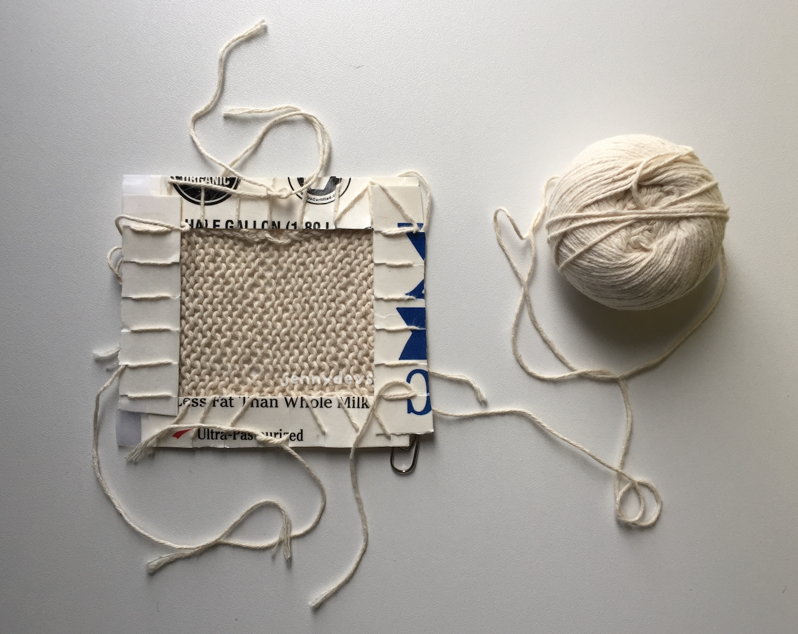

I would've clamped this between two popsicle stick frames to act similarly to a mould and deckle, but it was a little flimsy so I stopped with this experiment [2].

I did make another frame out of stacked 1 cm wide milk carton strips with tape to hold them together, but nothing resulted from it. However, I learned that tape is much stronger than hot glue underwater.

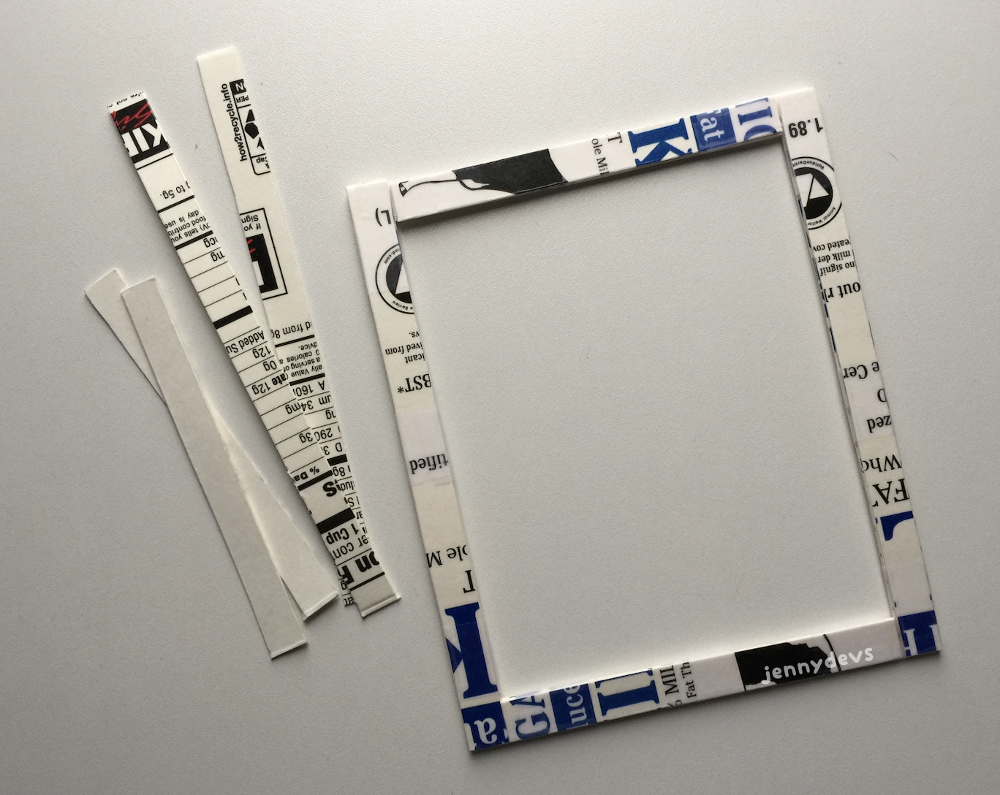

From using milk cartons as a material, I learned that the uncoated cut edges are not waterproof at all. If it absorbs too much water, it bends. However, it does dry quickly.

## >> Researching the bamboo screen

At this point in time, I rediscovered books through Project Gutenberg. They have papermaking books in their catalog, and one particular book I saw (but I can't find again to credit), noted that there was an alternative to the classic mould and deckle. This was important because I didn't have any wire mesh to use for papermaking. From what I could remember, it was a book about Western papermaking and it noted that there was a Japanese tool called a "suketa" / "sugeta", which uses a bamboo screen rather than wire mesh. When I searched for it online, I only found results about where to buy one, but not how to make it.

I did learn that there were many videos on the process of Japanese papermaking using a suketa on YouTube. From what I watched, the tool looks like it has two hinged frames and a separate screen made of bamboo. The only difference between a suketa and a mould and deckle, is the removable screen. The papermaking videos were intriguing to watch, but it wasn't what I was looking for.

Somehow, I found a video on Facebook about creating a bamboo screen for Chinese papermaking. Not long after, I found another video showing a similar process in building a screen for Vietnamese papermaking.

## >> Making a popsicle stick screen

Now that I have a general idea of how they're made, I was ready to make a simplified version with materials I have on hand. In the papermaking videos, when I saw them picking up the screen and rolling the paper off, I was reminded of sushi mats. I figured that a sushi mat would be similar enough to a bamboo screen, so I looked for videos that showed how to make one (as I assumed those videos would be more readily available).

I found one showing how to repair sushi mats and another one for making a mini sushi mat prop. I tried sewing [3] some popsicle sticks together based on the repair video and made something akin to a Jacob's Ladder toy. It was fun to shake around and easy enough to store away.

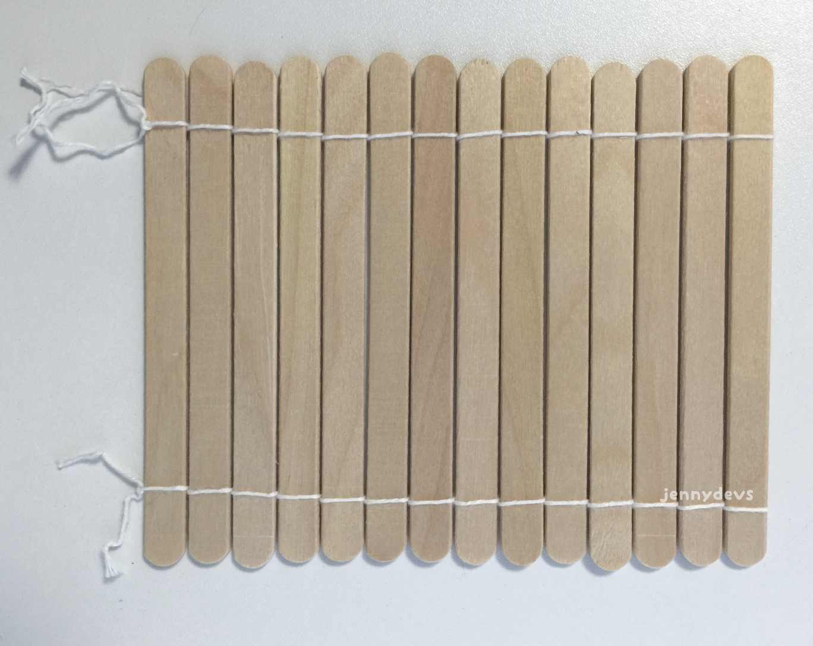

## >> My first papermaking attempt

I soaked some paper overnight and some other paper for several days to see if it made the scraps easier to turn into pulp. The soaking time didn't seem to make any difference...

I didn't have a blender or a mortar and pestle, so I got a clean yogurt cup and a pen ready to break down the paper. I hit the paper with the end of the pen repeatedly until it started to break down. I ripped them apart to help the process and eventually, it became paper pulp. There were a lot of clumps, but it was good enough.

I poured the pulp into a small container filled with water and swished it around to disperse it. The pulp settles to the bottom quickly so I had to work fast. The milk carton deckle I had previously fell apart before I could use it to form any paper. I tried to scoop the pulp with the popsicle screen but it didn't work out either.

Things weren't going very well. I didn't account for the threads on the screen being affected by water. They pulled the sticks together, which made it difficult for water to past through. The water and paper pulp just slid off of it.

At this point I gave up on scooping the pulp and instead poured the pulp directly onto the screen. I flattened the pulp down as much as I could and then placed that screen face down onto a paper towel. I managed to peel it off the screen and onto the towel.

Paper!

I blotted the paper and flipped it back and forth when it was dry enough to do so. I did this because I didn't want the pattern of the paper towel to be imprinted onto the paper. I left it to dry on the table and by the next day, it was dry.

It was pretty cool to see the pattern of the screen on the paper. You could see the thread lines and the gaps between the popsicle sticks imprinted onto the paper.

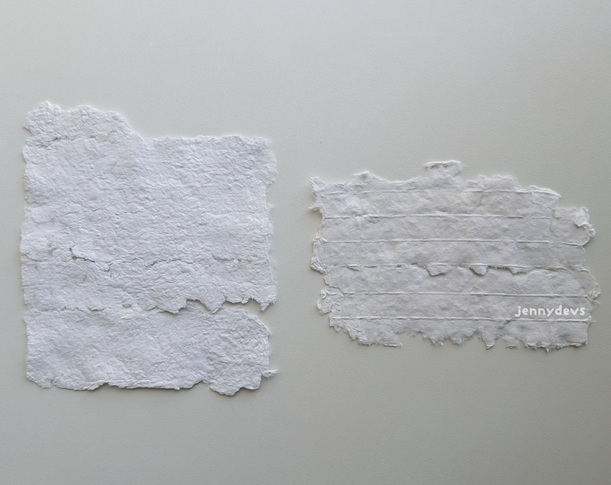

I cleaned up and sieved any leftover pulp from the water through some paper towels. It's not something you want in your plumbing. A great thing about it, is that paper chunks form right on the towel paper! These pieces can be stored away for another papermaking opportunity.

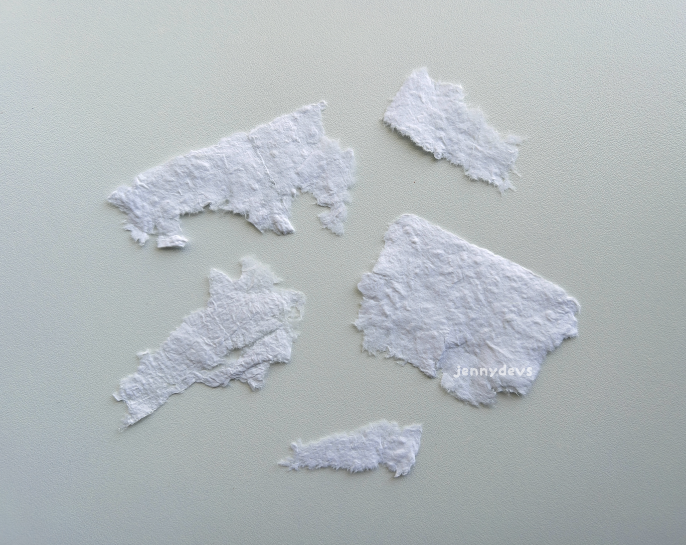

For my first papermaking attempt, I could see that making paper was the easy part. The difficult part is forming it properly. I needed a finer screen and a working deckle. 

## >> A small, new, better milk carton frame 

This time, I figured that I could cut a whole frame out of one milk carton panel. This means that I didn't have to use glue to keep the sides of the frame together. However, I could only make a deckle sized for a 3 cm x 4 cm sheet. The sides of the frame were cut 2 cm in width, which was enough space for me to hold onto. One panel is too thin on its own as it will bend underwater, so I cut out eight total pieces to put together, four for each frame.

I tied the stacks together with arbor knots [4], which were something I learned about in a forum. I could untie it easily without cutting it to dry out the layers of the milk carton frames. If the knot became loose, then I could tighten the knot again.

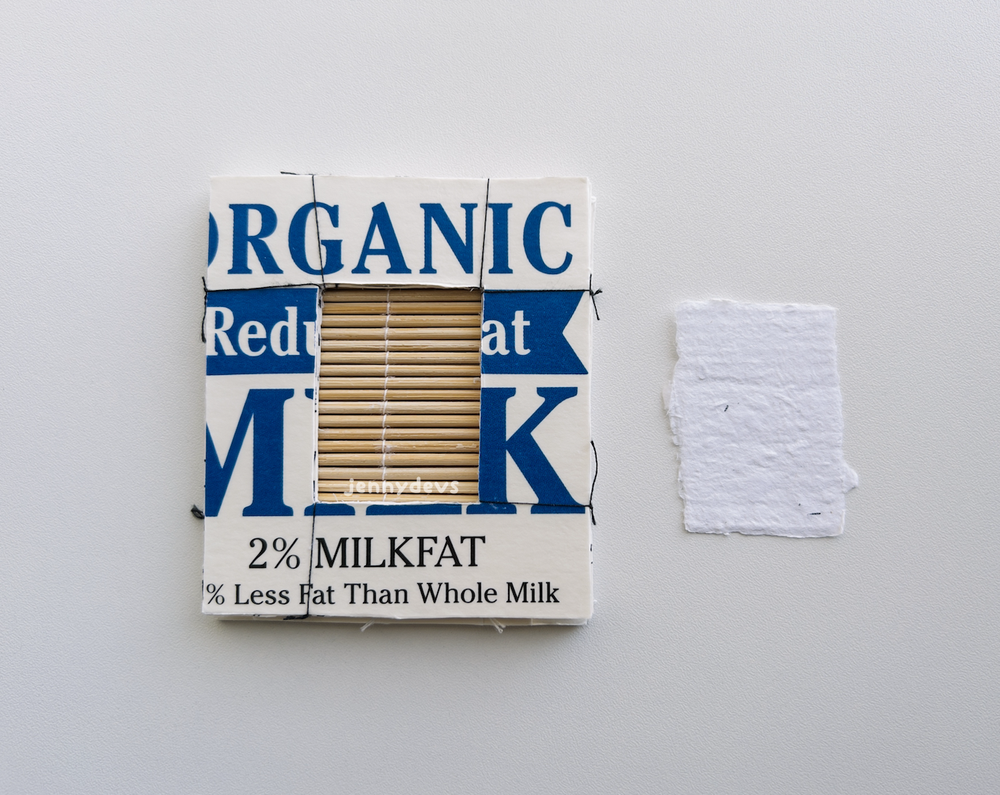

## >> Small screen made out of toothpicks

I couldn't find any skewers, but I did find a container of bamboo toothpicks [5] sitting in one of the cupboards.

I determined the amount of toothpicks by placing enough of them to cover the hole in the frame. I also added some more to account for sewing thread shrinkage this time. After measuring the amount of toothpicks, I cut off the pointed ends and sanded them flat. I sewed them together and attached two milk carton strips on either end for holding points. The resulting screen is uneven, but there's just enough room for a 3 cm x 4 cm sheet of paper to form on top.

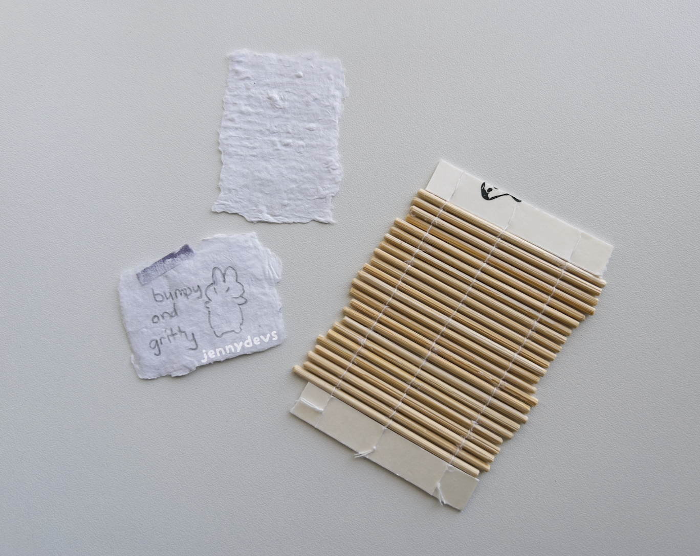

## >> Working on hinges for the frame

With two separate frames and a screen, they were definitely going to slide around as I held them together. I wanted to connect the frames together so I didn't have to deal with that while making paper.

At first I made loops out of milk carton strips and attached them between the frame layers. I stuck a wooden dowel into the loops so it would act like an actual hinge. The idea worked, but it fell out without glue. As an alternative idea, I could have made holes in the frames and tied them together with thread, but it probably would have been difficult to move the frames apart.

I tried replicating the cardboard hinges in a video I watched using tape in the same way. It allowed the frames to rotate around and kept it from moving side to side. When I did my second attempt at papermaking, the tape lasted long enough to make a decent amount of paper sheets before sliding off.

After all that trial and error, I decided to tie the frames directly to a wooden dowel. It worked nicely and stayed together for my most recent attempt.

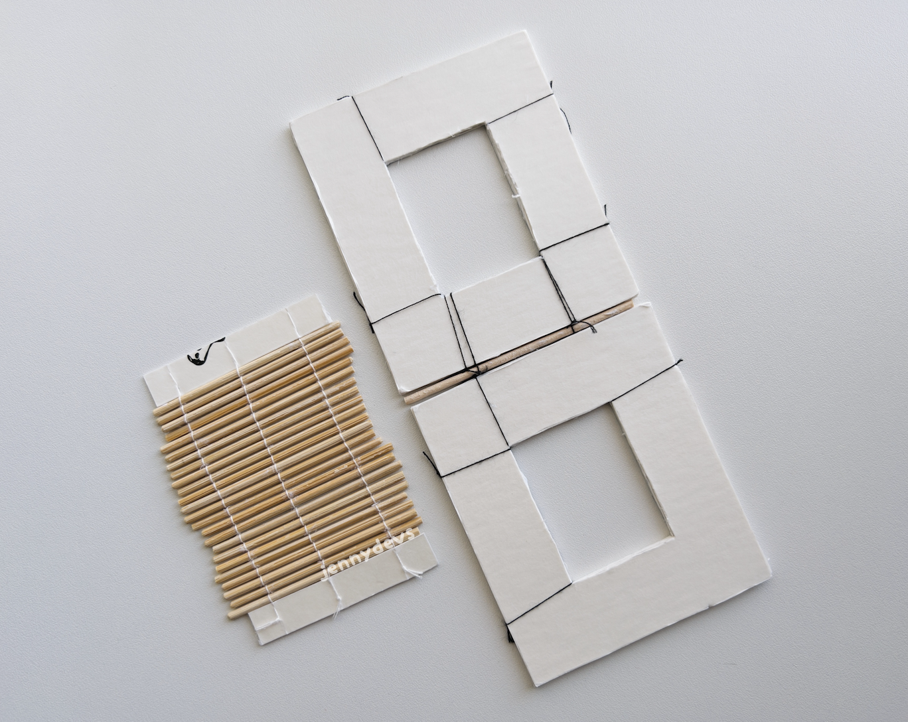

## >> Third attempt at papermaking

I made some paper pulp and tried again for the third time [6]. I found a larger tub, which I filled less than halfway with water. I didn't make enough paper pulp this time, so I leaned the tub at an angle to gather the pulp together. There was a decent amount of space for my hands this time!

I swished around the pulp beforehand and then clamped the screen between the frames [7] to scoop the pulp. I dipped the frame in and scooped upwards in a gentle "u" motion. There's a certain technique to this! It's difficult because the deckle side of the frame has a shallow depth. The paper pulp doesn't stay in and gets washed out in the next dip. 

Keep the frame close to the surface and move it back and forth to pick up the pulp evenly. It would have been easier with a lot more pulp in the water. When there was a decent amount of pulp on the screen, I lifted the frame out of the water and let it all drip down. The edges of the frames and the threads aren't smooth so they can catch onto the paper when I lift the deckle side. I just lightly pushed the paper down so it stays on the screen.

I took the screen out and rolled the sheet right onto a paper towel. Some sheets needed to be peeled off the screen though. I let some sheets dry on the paper towel without agitating them and moved other sheets onto a smooth table. I also left some on thin, smooth cardboard from some packaging too. With the fan running in the background, they were dry within a few hours.

The paper towel sheets were imprinted with a paper towel pattern and the ones on the table were smooth and shiny. The sheets on thin cardboard dried with a strong ribbed texture from the screen. In all of the papers, the texture of the screen came through nicely.

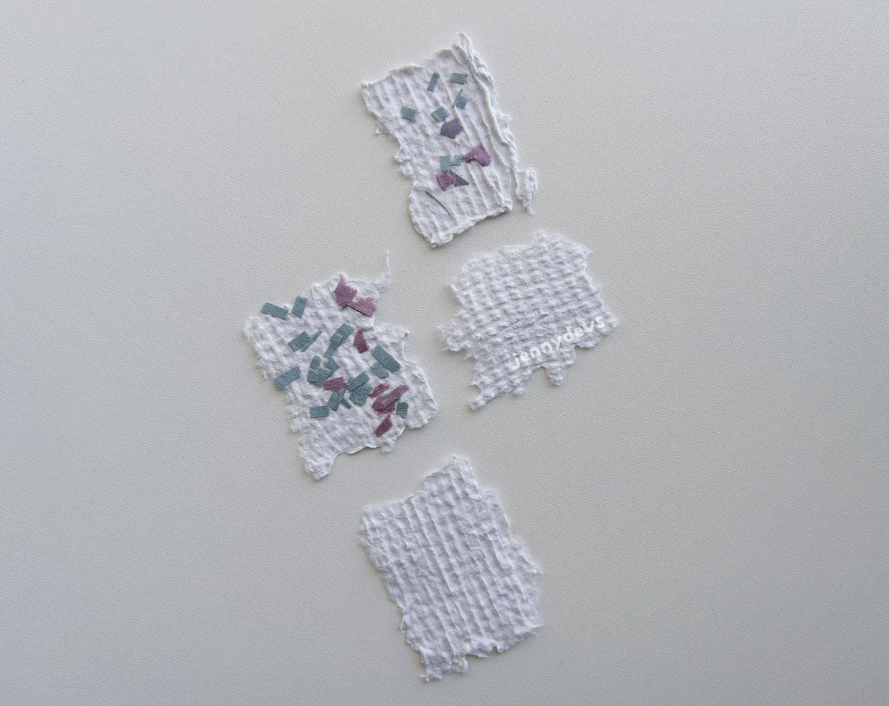

## >> My thoughts at the end of this adventure

They're not perfect, but they were close to 3 cm x 4 cm in size. I was surprised at the crisp edges of the paper sheets. 

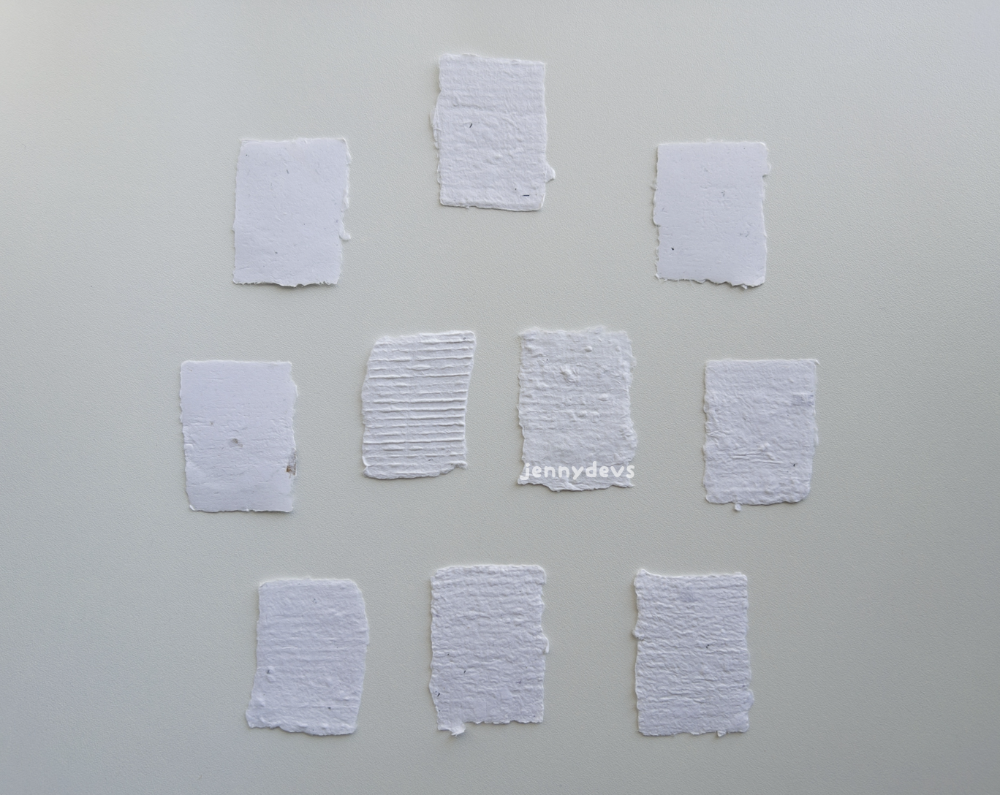

In my previous attempt, the edges were bumpy and the papers were quite lumpy. As seen below:
  
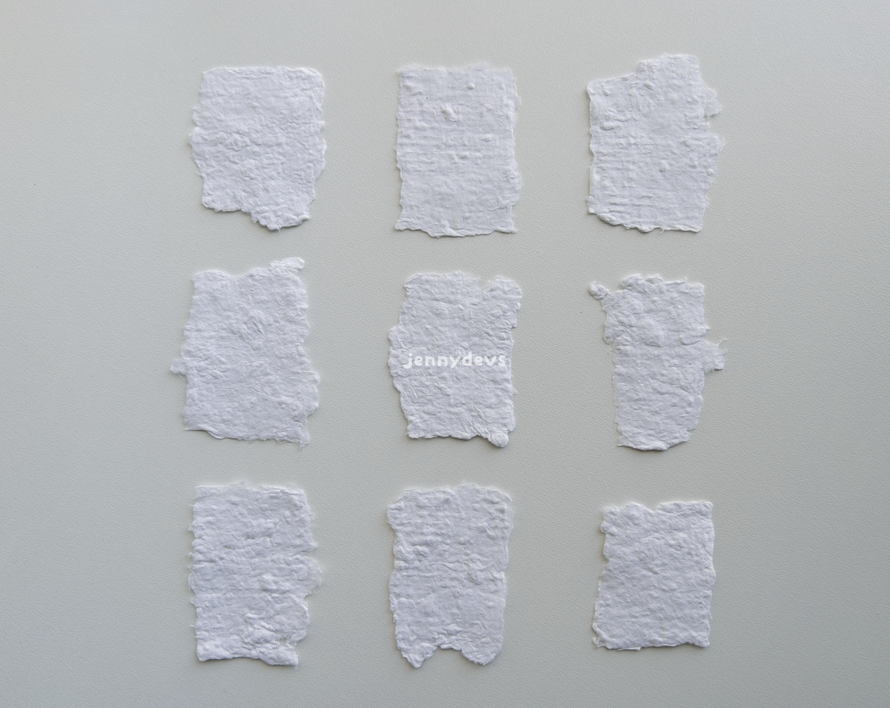

You could also make the paper really quite thin if you wanted to. This piece of paper below was made without a deckle right on the screen and the edges are thin quite like tissue paper.

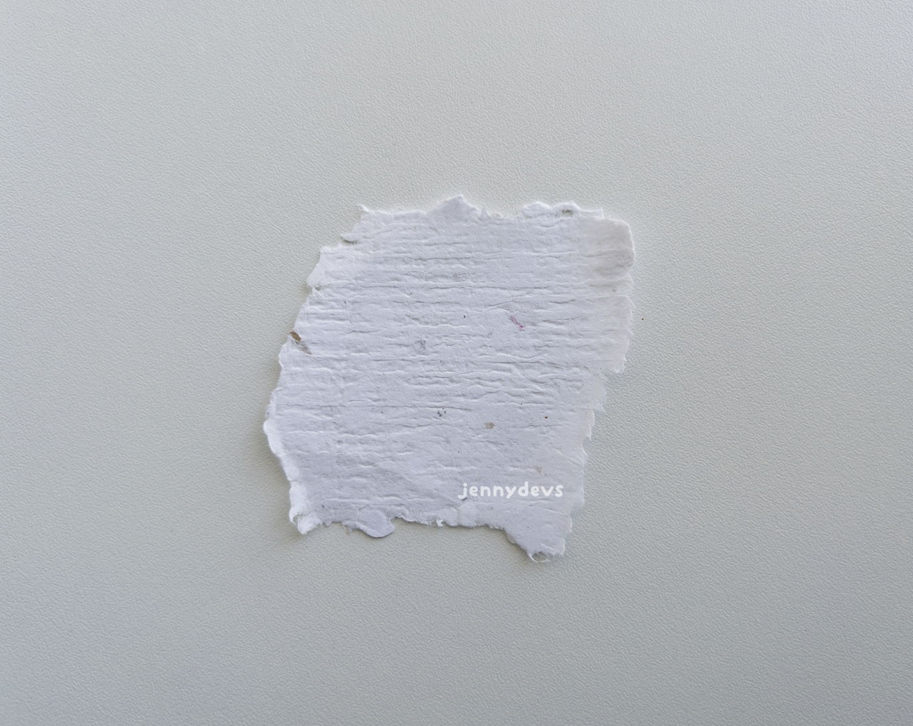

When I tried to stamp the papers with alcohol ink, the paper fibers stuck to the stamp which wasn't fun. Misting the paper helped somewhat, but I lost a bunch of details in doing so.

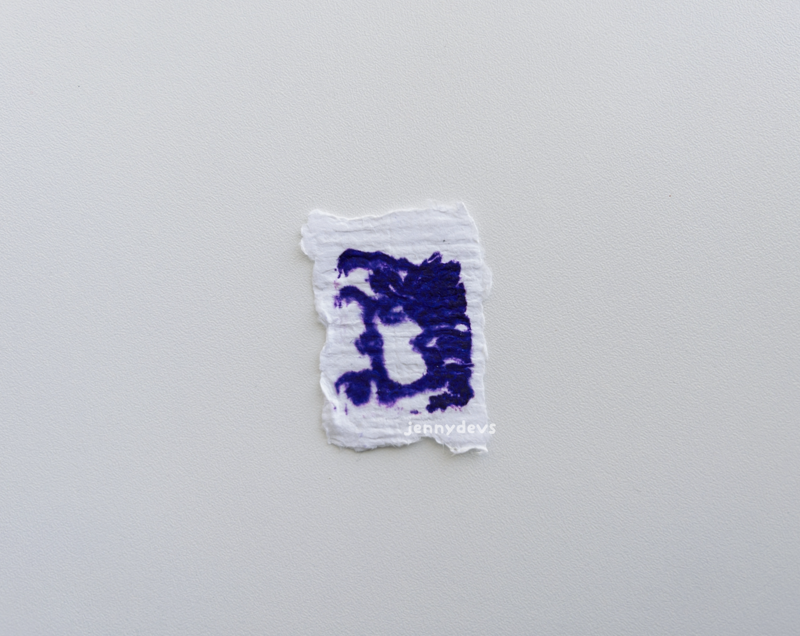

Gouache does works on the dry paper sheets, so I think I'll be experimenting with that later on.

When I work on this again, I would like to experiment with different materials to make screens. Thin straws, metal wire, and skewers seem like good materials. Clay could be used to make the deckle frame instead of wood, or in this case, milk cartons. There are more keywords to research like sizing, watermarks, calendaring, etc, but I'll leave those for another time. 

The paper I have now is unsatisfactory for printmaking, but I hope to apply what I've learned to make proper and bigger tools and sheets of paper later on.

## >> Footnotes

[1]: I like the untrimmed edges, but I want to have the choice of trimming it, should I make the deckle slightly larger? Hmm...

[2]: Perhaps I could've made a mesh out of the milk carton itself? There's a tedious idea for another time.

[3]: I could've used a thin threader for pulling the thread through instead of a sewing needle...

[4]: Normal knots would have been fine...

[5]: I specify bamboo because the pulp didn't seem to stick to it as much as it stuck to wooden dowels of a different kind.

[6]: My second attempt was super messy (spilled water) and this devlog is getting too long so I'm omitting it.

[7]: I don't know what to call this tool at all... It's not quite a mold and deckle or a suketa... I like just calling it frames and a screen.

## >> Resources I found for papermaking

Book on Project Gutenberg about Western papermaking with a remark about the "suketa" that inspired me to start researching alternatives to the mould and wire mesh screens
  - Missing source...

Japanese papermaking
  - [https://www.youtube.com/watch?v=ZeruBYGXaNk](https://www.youtube.com/watch?v=ZeruBYGXaNk)
  - [https://www.youtube.com/watch?v=k--cnSbS1gU](https://www.youtube.com/watch?v=k--cnSbS1gU)
  - [https://www.youtube.com/watch?v=Oc-A4juLgsk](https://www.youtube.com/watch?v=Oc-A4juLgsk)

Suketa from Aimee Lee
  - [https://www.aimiaartworks.com/suketa.html](https://www.aimiaartworks.com/suketa.html)

Korean papermaking
  - [https://www.youtube.com/watch?v=1_nWOO10ODk](https://www.youtube.com/watch?v=1_nWOO10ODk)

Chinese bamboo screen craftsmanship
  - [https://www.facebook.com/AcrossAsiaPage/videos/crafting-the-tang-dynastys-papermaking-bamboo-screen/776213474695193/](https://www.facebook.com/AcrossAsiaPage/videos/crafting-the-tang-dynastys-papermaking-bamboo-screen/776213474695193/)

Vietnamese papermaking and screen craftsmanship
  - [https://www.youtube.com/watch?v=MMstQw0m3TE](https://www.youtube.com/watch?v=MMstQw0m3TE)

Sushi mat prop and repairs
  - Sushi mat prop
    - [https://www.youtube.com/watch?v=IzbBYglZzDA](https://www.youtube.com/watch?v=IzbBYglZzDA)
  - Sushi mat repairs
    - [https://www.youtube.com/watch?v=xuMSvpEo1AI](https://www.youtube.com/watch?v=xuMSvpEo1AI)
    - [https://www.youtube.com/watch?v=iQw65hud1FA](https://www.youtube.com/watch?v=iQw65hud1FA)

Arbor knot
  - Forum
    - [https://arbtalk.co.uk/forums/topic/94029-slip-knots-for-log-bundles/](https://arbtalk.co.uk/forums/topic/94029-slip-knots-for-log-bundles/)
  - Knot tutorial
    - [https://www.youtube.com/watch?v=y1d0LikjiC4](https://www.youtube.com/watch?v=y1d0LikjiC4)

Cardboard hinges
  - [https://www.youtube.com/watch?v=dciE0sqWrUQ](https://www.youtube.com/watch?v=dciE0sqWrUQ)

Paper watermarks
  - [https://nycroblog.com/2023/03/14/patterns-in-paper-an-introduction-to-watermarks-found-within-record-office-collections/](https://nycroblog.com/2023/03/14/patterns-in-paper-an-introduction-to-watermarks-found-within-record-office-collections/)

Awagami Factory
  - [https://www.jacksonsart.com/blog/2024/01/24/on-location-at-awagami-factory/](https://www.jacksonsart.com/blog/2024/01/24/on-location-at-awagami-factory/)

Reddit r/papermaking
  - [https://www.reddit.com/r/papermaking/](https://www.reddit.com/r/papermaking/)

DIY mould and deckle
  - [https://paperslurry.com/blog/2014/08/01/make-mould](https://paperslurry.com/blog/2014/08/01/make-mould)

### >> Miscellaneous resources after the fact

Leaves papermaking
  - [https://www.youtube.com/watch?v=V10GaezQWhs](https://www.youtube.com/watch?v=V10GaezQWhs)

Presentation on papermaking
  - [https://www.youtube.com/watch?v=TH9bfbjOP_4](https://www.youtube.com/watch?v=TH9bfbjOP_4)

Texts on papermaking
  - [https://www.magnoliapaper.com/](https://www.magnoliapaper.com/)

Large-scale papermaking
  - [https://jerinpaulson.blogspot.com/2010/09/large-scale-papermaking.html](https://jerinpaulson.blogspot.com/2010/09/large-scale-papermaking.html)

Washi workshop
  - [https://hanga-land.blogspot.com/2019/02/workshop-washi.html](https://hanga-land.blogspot.com/2019/02/workshop-washi.html)

Korean papermaking and Hanji screen craftsmanship
  - [https://www.youtube.com/watch?v=ZITaAE07SQ0](https://www.youtube.com/watch?v=ZITaAE07SQ0)
  - [https://www.youtube.com/watch?v=a0PsSyjCigg](https://www.youtube.com/watch?v=a0PsSyjCigg)
